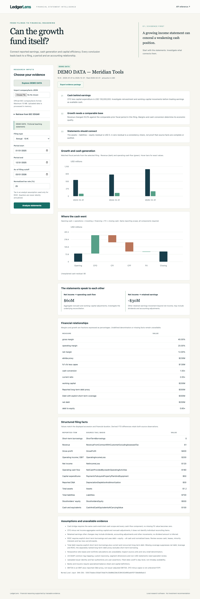

# LedgerLens

**Can the growth fund itself?** LedgerLens connects earnings, cash generation and capital efficiency to the exact financial periods and filings behind them. It is a local financial-statement research workbench built with typed Python, FastAPI and a browser UI.

[](https://github.com/CSingh26/LedgerLens/actions/workflows/ci.yml)

Revenue growth alone cannot establish financial strength. LedgerLens asks whether cash conversion supports earnings, whether capital earns an adequate return, and whether the three statements reconcile. Each output preserves its source tags, accession, filing date and assumptions; missing evidence remains unavailable.



## Run locally

Python 3.12 and Node 22+ are supported. Node is needed only for browser checks; the product runs in Python.

```sh
python3.12 -m venv .venv
.venv/bin/pip install -r requirements.lock
.venv/bin/pip install --no-deps -e .
.venv/bin/python -m uvicorn ledgerlens.api:app --host 127.0.0.1 --port 8195
```

Open http://127.0.0.1:8195. API documentation is at `/docs`.

## A 90-second analyst walkthrough

1. Select **Explore DEMO DATA**. Meridian Tools is a fictional teaching issuer, visibly labeled throughout.
2. Read the earnings/cash conclusions, then compare revenue and CFO and inspect the opening-to-closing cash bridge.
3. Scroll the financial relationships table for growth, margins, liquidity and ROIC. The demo produces 25% revenue growth, $130 million CFO less capex, and a zero cash reconciliation residual.
4. Change the normalized tax rate: old results clear. Recalculate and inspect the ROIC assumption.
5. Export an evidence package. Reimport it and recalculate; imported results are never trusted as calculations.

## Bring actual filing data

Download SEC companyfacts JSON or use **Retrieve from SEC EDGAR** with a numeric CIK and your own identifying User-Agent/contact email. No API key is required. Choose the actual annual or quarterly start/end and an as-of filing cutoff. A revenue fact anchors the selected accession; absent matching revenue produces an explicit error. Live failures do not fall back to demo data. Offline uploads remain labeled **USER PROVIDED DATA**, even if their contents claim SEC origins.

The API supports `GET /api/demo`, `POST /api/import` (raw companyfacts JSON), `POST /api/fetch` (`cik`, `user_agent`), and `POST /api/analyze` (`companyfacts`, `query`, `source_label`). The demo endpoint returns a complete example analysis request. Request and provider bodies are capped at 10 MB.

## Financial scope

- Exact annual/quarterly facts, as-of filing filters, comparable fiscal periods, YoY/QoQ and positive-base CAGR.
- Gross/operating/net margins, EBIT and qualified EBITDA proxy, EPS, CFO less capex, liquidity, leverage, annual ROA/ROE and normalized-tax ROIC.
- Cash, retained-earnings and earnings-to-CFO connections with visible missing components and residuals.
- Quarterly cash flows derived from compatible YTD observations only, with both source observations retained.
- Evidence export includes normalized input hash, selected facts, derived calculations, assumptions and available raw retrieval provenance.

This is a common-tag US-GAAP research tool, not a complete XBRL statement reconstruction or investment recommendation. It deliberately leaves ratios unavailable when short-term debt coverage or other inputs are missing. Banks, insurers, custom tags, segments and non-USD statements need specialist treatment. See [methodology](docs/METHODOLOGY.md), [data dictionary](docs/DATA_DICTIONARY.md), [limitations](docs/LIMITATIONS.md), [architecture](docs/ARCHITECTURE.md) and [delivery evidence](docs/PORTFOLIO_DELIVERY.md).

## Verify

```sh
npm ci
npx playwright install chromium
CI=1 bash scripts/verify.sh
```

CI runs 38 Python and five browser tests, Ruff, strict mypy, JavaScript syntax/format checks, source/wheel builds and a tracked-file secret-pattern check. Browser checks exercise real imports, calculation state, exports, provenance, responsive layout and hostile issuer text. See [contributing](CONTRIBUTING.md).

## Source references

The provider uses the official [SEC EDGAR APIs](https://www.sec.gov/search-filings/edgar-application-programming-interfaces) and identifying-contact/fair-access guidance in [SEC developer resources](https://www.sec.gov/about/developer-resources). Structured facts are research inputs; consult the underlying filing and the SEC's [financial-statement dataset guidance](https://www.sec.gov/file/financial-statement-data-sets) when assessing completeness.
